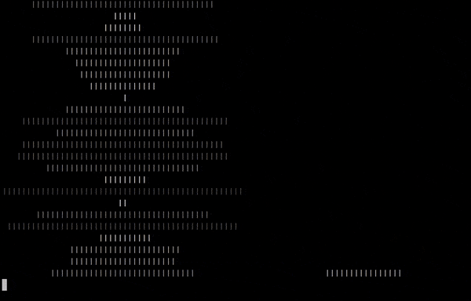

# push_swap
Given an unsorted stack, sort it! This project is within the algorithms branch at [42 Silicon Valley](https://www.42.us.org/) and was expanned on to include a visualizer to see my algorithm in action. The first program, **push_swap** outputs the commands. The second program, **checker**, determines if it is a valid command list.

## Constraints and Rules
- Only two stacks can be used, A and B
- The commands allowed to be outputted by **push_swap**:
  - **Push** to opposite stack
    - pa - push to A
    - pb - push to B
  - **Rotate Forward** stack by one element
    - ra - rotate A
    - rb - rotate B
    - rr - rotate A && B
  - **Rotate Reverse** stack by one element
    - rra - rotate reverse A
    - rrb - rotate reverse B
    - rrr - rotate reverse A && B
  - **Swap** top two elements
    - sa - swap A
    - sb - swap B
    - ss - swap A && B

- The project is graded on the number of outputted operations. My algorithm is a variant of merge sort and efficently sorts in O(N(Log(N))) time.
 
 ## Installation and Executing

```bash
git clone https://github.com/tfdiaz/push_swap
cd push_swap
make && make clean
```
Three binaries will be created.
> push_swap
> 
> checker
> 
> visualizer

Any list of random non-duplicate numbers separated by a space will do as input to push_swap. As below:
```bash
./push_swap 10 3 4 2 6 1 2
```
This will output a list of commands.
You can pipe this to the checker to verify that a sort as been achieved.
```bash
./push_swap 10 3 4 6 1 2 | ./checker 10 3 4 6 1 2
OK
```
But the real fun is when you pipe it to the visualizer and use more numbers. Below are 50 numbers.

```bash
./push_swap 21 16 38 28 5 40 8 33 39 3 24 18 20 27 19 7 14 17 1 6 25 15 43 41 29 13 42 37 44 35 32 45 9 4 50 26 2 34 36 12 48 47 11 46 23 10 22 49 30 31 | ./visualizer 21 16 38 28 5 40 8 33 39 3 24 18 20 27 19 7 14 17 1 6 25 15 43 41 29 13 42 37 44 35 32 45 9 4 50 26 2 34 36 12 48 47 11 46 23 10 22 49 30 31
```


The above illustrates the actions from stack A and stack B. This is done using simple ANSI escape codes and printf. The visualizer works in the terminal.


